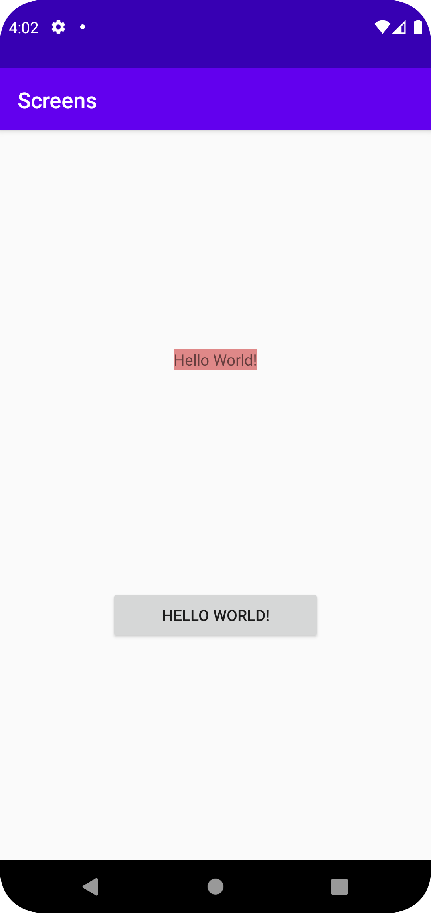

# Rapport

**Skriv din rapport här!**

_Du kan ta bort all text som finns sedan tidigare_.

## Följande grundsyn gäller dugga-svar:

- In this project i started by creating an adisional main activity, then not in cronical orrder i find the xml button by passing its ID where on its clikclistnern, i instantiate a new intent, that sends the user from ma (current) to ma2 when ever the user click on the button. i also belive that i send a bundle with the lable "text" and "number"
```
        Button button = findViewById(R.id.button);
        button.setOnClickListener(new View.OnClickListener() {

            @Override
            public void onClick(View view) {
                Intent intent = new Intent(MainActivity.this, MainActivity2.class);
                intent.putExtra("text", "Ronya Rövardotter:\nBlodet ska rinna!"); // Optional
                intent.putExtra("number", 888); // Optional
                startActivity(intent);
            }
        });
```
- that i latter use to re name both of the text views as seen bellow, where i first find them, and then a set the text to that i expect.
```
        Bundle extras = getIntent().getExtras();
        String texty = null;
        int number = 0;
        if (extras != null) {
            texty = extras.getString("text");
            number = extras.getInt("number");
            // Do something with the name and number
        }

        TextView textView = findViewById(R.id.text);
        TextView textView1 = findViewById(R.id.text1);
        textView.setText(texty);
        textView1.setText("" + number);
```
- I have also made the MainActivity2 a child of MainActivity
```
        <activity
            android:name=".MainActivity2"
            android:parentActivityName=".MainActivity"
            ...
```
Bilder läggs i samma mapp som markdown-filen.



Läs gärna:

- Boulos, M.N.K., Warren, J., Gong, J. & Yue, P. (2010) Web GIS in practice VIII: HTML5 and the canvas element for interactive online mapping. International journal of health geographics 9, 14. Shin, Y. &
- Wunsche, B.C. (2013) A smartphone-based golf simulation exercise game for supporting arthritis patients. 2013 28th International Conference of Image and Vision Computing New Zealand (IVCNZ), IEEE, pp. 459–464.
- Wohlin, C., Runeson, P., Höst, M., Ohlsson, M.C., Regnell, B., Wesslén, A. (2012) Experimentation in Software Engineering, Berlin, Heidelberg: Springer Berlin Heidelberg.
